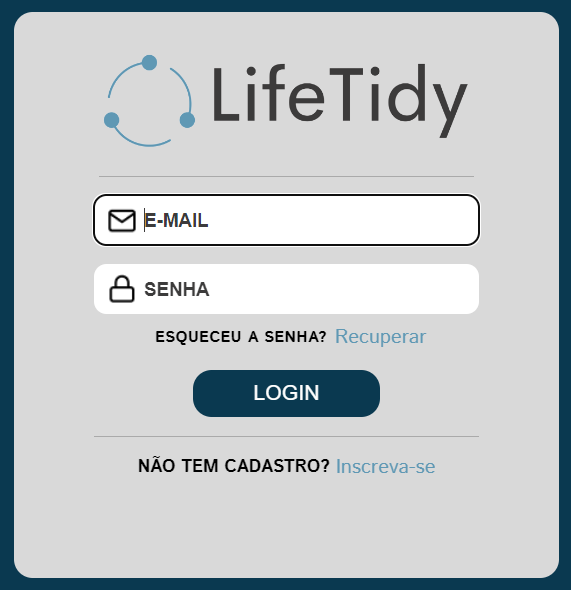
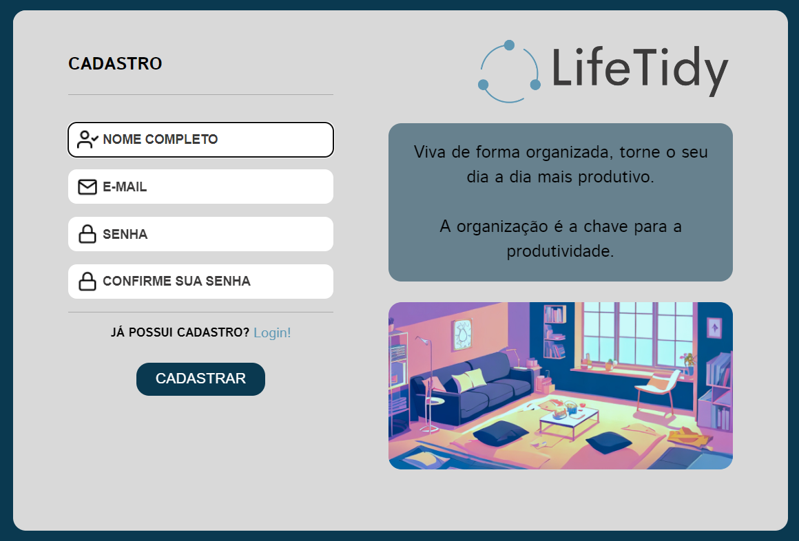
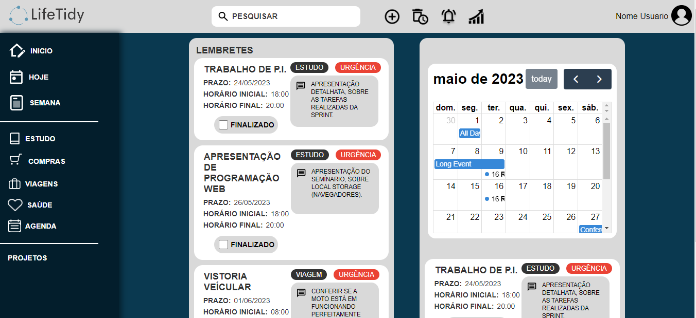

# Projeto Life Tidy
> (Em desenvolvimento)

## Tela de Cadastro e de Login
 

## Tela Inicial

> Plataforma web feita com HTML, CSS e JavaScript. Gerenciador de tarefas.

### 💡 Ideia do projeto:

Com a correria do dia a dia e a falta de tempo, muitas pessoas enfrentam problemas decorrentes do esquecimento. Pensando nisso, surge a ideia do LifeTidy, um aplicativo que visa ajudar os usuários a organizarem suas atividades cotidianas de forma simples e eficiente.

### 🛠️ Ajustes e melhorias:

O projeto não finalizado, está aberto para novas modificações. As próximas atualizações serão voltadas nas seguintes tarefas:

- [x] Utilização do HTML 
- [x] Utilização do CSS
- [X] Utilização do JavaScript(API)
- [x] Página de Cadastro 
- [x] Página de Login
- [x] Tela Inicial(Em desenvolvimento)
- [ ] Tela de Apresentação
- [ ] Tela de Categorias

### 🎯 Objetivo:

O objetivo do projeto é criar um aplicativo de organização que ofereça aos usuários uma maneira eficiente de gerenciar e controlar suas tarefas, compromissos e informações pessoais, o aplicativo será composto por abas para diferentes categorias de organização, como mercado, estudo, trabalho, saúde entre outras, cada uma com opções específicas de tarefas e informações a serem gerenciadas.

#### 🤝 Desenvolvido por:

<table>
  <tr>
    <td align="center">
      <a href="https://www.linkedin.com/in/jose-nataniel/">
         
        
          <b>Nataniel Andrade</b>
        
      </a>
  </tr>
</table>

[⬆ Voltar ao topo](#projeto-life-tidy) 
